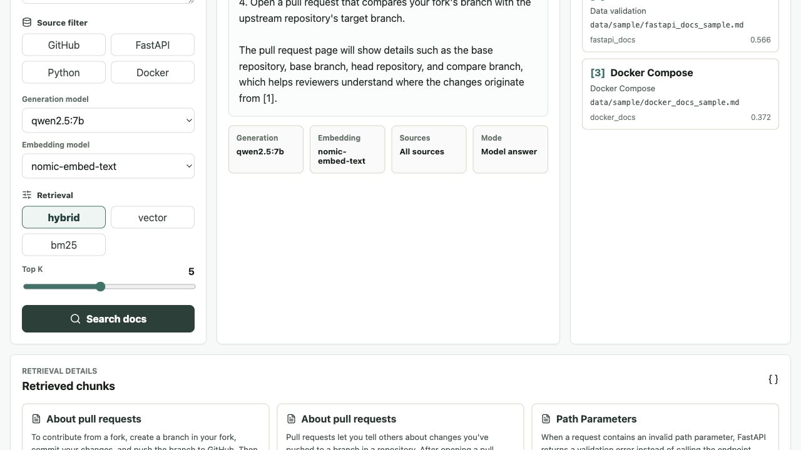
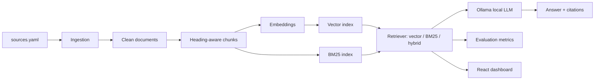

# Local Developer Docs RAG

[](https://github.com/AbdullahOztoprak/LLM-case/actions/workflows/ci.yml)

A local RAG workbench for developer documentation. It indexes documentation sources,
retrieves relevant chunks with vector/BM25/hybrid search, and uses a local Ollama model
to answer with citations.

The main UI is a React/Vite dashboard backed by a FastAPI service.

## Why This Exists

This project is built around three practical questions:

1. Can a local LLM answer developer documentation questions without external APIs?
2. Can the system show which sources and chunks were used?
3. Can retrieval quality be measured with a small evaluation set?

If Ollama is not running, the backend returns a retrieval-only preview instead of
crashing. That keeps the ingestion, retrieval, citation, UI, and evaluation paths easy to
test on a fresh clone.

## Screenshot

The dashboard below uses the included sample documentation.



## Features

- Source manifest in `sources.yaml`
- Sample mode for quick local smoke tests
- Full ingestion mode for configured public documentation repositories
- Markdown/RST ingestion with source, path, license, and attribution metadata
- Heading-aware chunking with stable chunk IDs
- Deterministic local embedding fallback for tests and sample runs
- Optional Ollama embeddings for local indexing
- Persistent JSON vector index and Chroma adapter
- Retrieval modes: `vector`, `bm25`, and `hybrid`
- React/Vite dashboard with a search UI, citations, and retrieval details
- FastAPI endpoints: `/ask`, `/models`, `/health`
- Evaluation metrics: Recall@3, Recall@5, MRR, citation rate, refusal rate, latency
- pytest, ruff, Docker, Makefile, and GitHub Actions

## Architecture

```text
Docs -> Chunking -> Embeddings -> Vector/BM25 Index -> Hybrid Retrieval
     -> Local LLM -> Answer + Citations
```



## Data Sources

The configured source manifest is `sources.yaml`.

| Source | Purpose | License noted in manifest |
| --- | --- | --- |
| GitHub Docs | Developer workflow, pull requests, Actions, repositories | CC-BY-4.0 |
| FastAPI Docs | Backend API development | MIT |
| Python Docs | Python standard tooling and language docs | PSF-2.0 |
| Docker Docs | Containers and Compose workflows | Apache-2.0 |

## Quick Start With Sample Data

The sample-data path uses the small docs included in `data/sample/`. This is the fastest
way to verify the app without cloning large documentation repositories.

```bash
python -m venv .venv
source .venv/bin/activate
make install
make ingest-sample
make eval
make backend
```

In a second terminal:

```bash
cd frontend
npm install
npm run dev
```

Open the dashboard at `http://localhost:5173`. The backend runs at
`http://localhost:8000`.

## Full Ingestion Mode

Full ingestion mode downloads and indexes configured sources from `sources.yaml`.

```bash
make ingest source=github_docs
make ingest source=fastapi_docs
```

Equivalent direct command:

```bash
python scripts/ingest_sources.py --source github_docs
```

Without `source=...`, `make ingest` attempts to ingest every configured source. Raw cloned
repositories are written under `data/raw/`; local indexes are written under
`data/generated/`. Both are ignored by git.

## Ollama Models

The backend calls Ollama's local model list endpoint through:

```text
GET http://localhost:11434/api/tags
```

The React dashboard loads those models from `GET /models` and shows them in dropdowns.
Do not hardcode a qwen tag. If a Qwen model is available locally, the UI may select it by
default. Otherwise, any available Ollama generation model can be selected.

Generation and embedding models are separate:

- `GENERATION_MODEL`: writes the final answer from retrieved context
- `EMBEDDING_MODEL`: encodes documentation chunks and user questions for vector search

Example `.env`:

```env
OLLAMA_BASE_URL=http://localhost:11434
GENERATION_MODEL=qwen2.5:7b
EMBEDDING_MODEL=nomic-embed-text
TOP_K=5
RETRIEVAL_MODE=hybrid
```

Set `USE_OLLAMA_EMBEDDINGS=true` only when you want the index to use Ollama embeddings.
Rebuild the index after changing embedding behavior.

## Docker

Run the full stack:

```bash
cp .env.example .env
docker compose up --build
```

The React dashboard is available at `http://localhost:5173`; the FastAPI backend is
available at `http://localhost:8000`.

Ollama should be running on the host machine. The Docker backend uses
`http://host.docker.internal:11434` to reach it.

## API

`POST /ask` accepts:

```json
{
  "question": "How can I create a pull request from a fork?",
  "generation_model": "qwen2.5:7b",
  "embedding_model": "nomic-embed-text",
  "top_k": 5,
  "source_filter": ["github_docs"],
  "retrieval_mode": "hybrid"
}
```

The response includes:

- `answer`
- `sources`
- `retrieved_chunks`
- `latency_ms`
- `generation_model`
- `embedding_model`
- `retrieval_mode`
- `fallback_used`

Each retrieved chunk includes source metadata plus `combined_score`, `vector_score`, and
`bm25_score` for debugging.

## Evaluation

Run the smoke-test evaluation:

```bash
make eval
```

The default file, `data/eval/eval_questions.jsonl`, is intentionally small and is used as
a smoke test. Perfect scores on this sample set are not a production benchmark.

A larger starter set is included for full-source experiments:

```bash
make eval eval_path=data/eval/realistic_questions.jsonl
```

Metrics reported:

- `recall@3` and `recall@5`: expected source found in top-k retrieved chunks
- `mrr`: mean reciprocal rank of the expected source
- `answer_citation_rate`: answers with at least one source
- `no_context_refusal_rate`: answers that refuse due to missing context
- average retrieval and answer latency

## Repository Layout

```text
src/devdocs_rag/      Core ingestion, retrieval, generation, and API code
frontend/             React/Vite dashboard for the main product UI
scripts/              CLI-friendly ingestion and evaluation entry points
data/sample/          Small public-safe sample documentation
data/eval/            Smoke-test and starter evaluation questions
docs/                 Architecture, data source, and evaluation notes
tests/                Unit and API tests
```

## Limitations

- The bundled sample evaluation is intentionally small.
- Full-source indexing can take time depending on the selected source and embedding model.
- If Ollama is unavailable, answers fall back to retrieval previews.
- The project focuses on local experimentation, not hosted multi-user deployment.
